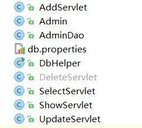

MVC 模式代表 Model-View-Controller（模型-视图-控制器） 模式。这种模式用于应用程序的分层开发。

- **Model（模型）** - 模型代表一个存取数据的对象或 JAVA POJO。它也可以带有逻辑，在数据变化时更新控制器。
- **View（视图）** - 视图代表模型包含的数据的可视化。
- **Controller（控制器）** - 控制器作用于模型和视图上。它控制数据流向模型对象，并在数据变化时更新视图。它使视图与模型分离开。

Servlet是一个特殊的Java程序，它运行于服务器的JVM中，能够依靠服务器的支持向浏览器提供显示内容。

JSP本质上是Servlet的一种简易形式， JSP会被服务器处理成一个类似于Servlet的Java程序，可以简化页面内容的生成。

 Servlet和JSP最主要的不同点在于

- Servlet 的应用逻辑是在Java 文件中，并且完全从表示层中的HTML分离开来。
- 而JSP的情况是Java和HTML可以组合成一个扩展名为.jsp 的文件（有人说，Servlet就是在Java中写HTML，而JSP就是在HTML中写Java代码，当然，这个说法还是很片面的）。

JSP侧重于视图，Servlet更侧重于控制逻辑，在MVC架构模式中，JSP适合充当视图（view）而Servlet适合充当控制器（controller）。

AddServlet、DeleteServlet、UpdateServlet、SelectServlet 对应增删改查

DbHelper：工具类 连接数据库

Admin：实体类(bean)

AdminDao：数据库交互层

控制层：AddServlet、DeleteServlet、UpdateServlet、SelectServlet 